# Setting Up Jellyfin Media Server
Deep Grewal - January 7, 2022

---

## My History with Media Centers
Most of us have a seemingly rag-tag, motley collection of digital files that we have accumulated over the years.  These can range from our favorite movies, television series, etc.  The way that I used to organize these was to give them a proper file name (example: "Borat.mp4") and put them into a folder titled "videos" or "movies", and that was it.  

Then one day, over a decade ago, I discovered that I could convert my first-generation Xbox gaming console into a media center with the Xbox Media Center (XBMC) project.  This worked beautifully, if you had the guts to make some modifications to a perfrectly good Xbox.  However, it was short-lived because the first-generation Xbox consoles could not display/output high definition video.  

A few years later, I switched to Kodi (a fork/continuation of XBMC).  I was a bit disappointed to see that the UI, settings, and configuration options were not improved upon and still seemed scattered about as they had been in XBMC.  Preparing this device for non-technical users was out of the question.  I wasn't going to get the buy-in from other family members with this.  It simply sat around installed and functional on a laptop whose video output was never switched to on the television.

By this point, some of you are probably thinking, what about Plex?  Plex is not open source and this is a deal-breaker for me, especially considering my collection of media files and the way some of these files were acquired.  Besides, if there are open source alternatives available, why not be a good FOSS citizen and support an open source project?

&nbsp;  
## Along Came Jellyfin
A few months back, I stumbled upon Jellyfin.  After checking out the [website](https://jellyfin.org) and reading the [documentation](https://jellyfin.org/docs/), it seemed like something that was dead-simple to [download](https://jellyfin.org/downloads/), install, configure, and go-live with.  Jellyfin has a broad ecosystem of [clients](https://jellyfin.org/clients/).  

I had all of the necessary ingredients: a machine to be the Jellyfin server, an older Android mobile phone (optional) that was no longer being used, and many compatible client devices throughout the home.  So, I gave it a go and here's my experience.

&nbsp;  
## The Jellyfin Server Hardware
That aforementioned laptop that was designed as the Jellyfin server is actually an HP Elitebook 8460p with the following specifications shown below.  The laptop's battery is so old that it no longer holds a charge and it must remain plugged-in to be functional.  Yet another reason as to why it is the ideal machine for this project.

CPU | RAM |Hard Disk
-|-|-
Intel Core i5-2520M @2.50GHz (4 Core) | 8.0 GB | Crucial M4 (CT256M4SSD2) SSD 256GB 

Surprisingly, these metrics are more than enough to run Jellyfin server with multiple concurrent clients!  I just had to be very picky about which distrubution of Linux to install.  Something modern, lightweight, stable, and efficient should do the trick.  

&nbsp;  
## The Operating System for Jellyfin Server
To help  narrow down the selection and make a decision on an ideal Linux distribution, I referred back to an [article](https://frontpagelinux.com/articles/lightweight-linux-distro-review-showdown-who-will-become-champion/) that I previously wrote about lightweight Linux distros.  For this project, I wanted the distro to have some eye candy to it.  I was quite certain that I would be showing it off to friends and family, so it might as well look appealing.  The first instinct was to go with Zorin OS Lite, but I was already using this distro for a custom OSINT box and decided to go with Linux Lite instead. 

Linux Lite is based on Ubuntu and doesn't have any deviations from Ubuntu which would interfere with the installation of Jellyfin server.  Once Linux Lite is installed, the distro idles with the following metrics.

### Linux Lite Usage Stats at Idle
CPU | RAM | Hard Disk
----|-----|----------
3% | 573 MB (7%) | 7.3 GB (3%)

Considering the hardware specs of the HP Elitebook 8460p, this usage summary is actually very good.  

I also like the canned wallappers that come with Linux Lite.  My favorite, of course, is the one pictured below.  Remember, I was going for eye candy with this distro selection.  This wallpaper helped to check that box and also sparked a craving for a particular type of recreational beverage.

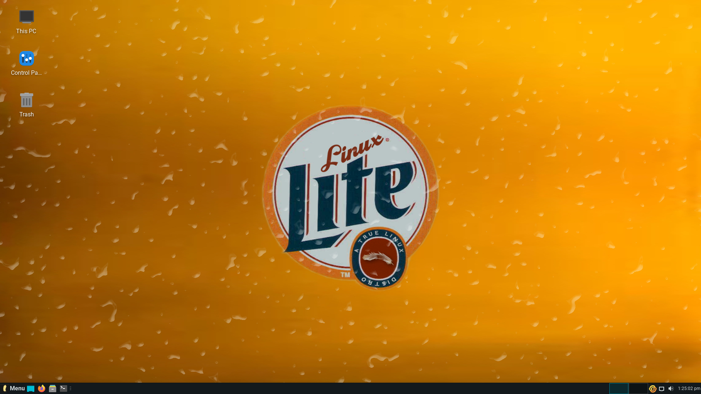

---
## Pre-Installation Recommendations
With the hardware and operating system squared away, let's consider some ease-of-use options that can be implemented to make this setup a little more spectacular.  The following set of steps are obviously not necessary, but will optimize and add some noticeable luxuries to a Jellyfin server setup.

### Adjust Power Settings
As mentioned, I used a laptop to be my Jellyfin server. This laptop has a video output that is connected to a television.  I don't need to leave the lid open and would prefer that the lid stayed shut while the laptop remained powered on 24/7, much like a server.  To accomplish this, power settings had to be tweaked.

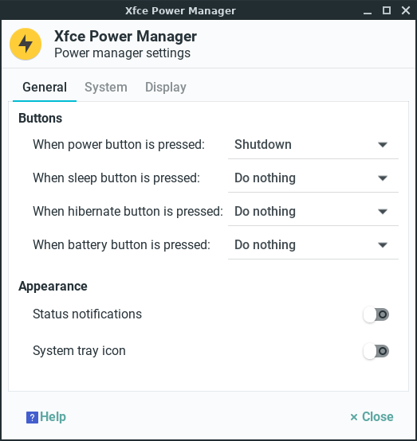

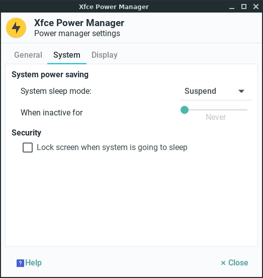

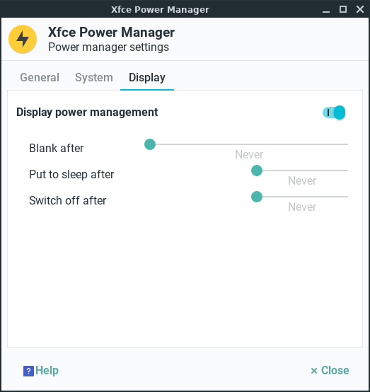

### Update and Simplify 
One of the first things that I do after installing a fresh distro is to apply updates and perform any clean up that might be necessary.

```
sudo apt update
sudo apt upgrade
sudo apt autoremove
```

To make it easier for any subsequent updates, I created a basic script that could be executed to peform the 3 steps above in 1 simple command. 

```
mkdir bin
echo 'apt update && apt upgrade -y && apt autoremove -y' > bin/update.sh
chmod +x bin/update.sh
```

The next time an update is needed, this is all that has to be done.  Execution of this script is perhaps more appreciated when you have to use an alternate keyboard to perform an update.

```
sudo sh bin/update.sh
```

### Install KDE Connect
With the lid of the laptop closed, there is no access to the keyboard or touchpad.  This seems problematic at first, unless you have heard of KDE Connect.  KDE Connect allows for a mobile device to act as a keyboard and mouse for a host machine.  But that's not all: KDE Connect also allows for a simple and direct transfer of any files that may be stored on a mobile device to the host machine.  So, any media files which are located on the mobile device can now be transferred to the Jellyfin server machine wirelessly, without fiddling with USB settings and dongles.

```
sudo apt install kdeconnect
```

Next, I launched the "KDE Connect Indicator" application from the menu.  

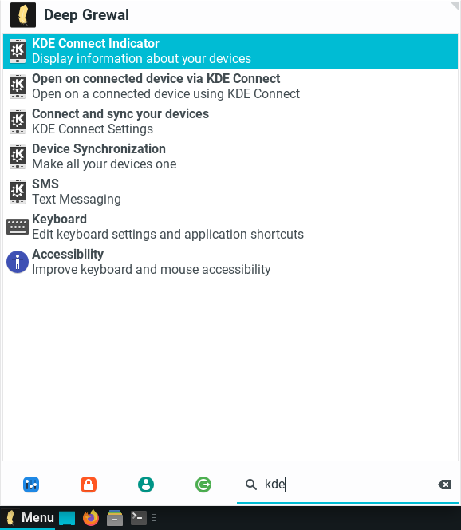

An icon with a "K" on it appeared in the bottom panel to the left of the clock.


To complete the setup, the "KDE Connect" application was installed on my spare mobile device which happens to be a Motorolo Moto G7 running LineageOS 18.  With the mobile device connected to the same wi-fi SSID as the Jellyfin server machine, pairing of the devices was completed.

### Install SSH Server
Installing the openssh-server package allows for `ssh` and `scp` commands to be performed against the server.  This comes in handy when you need to quickly perform updates or copy/move media files to or from the Jellyfin server.  

```
sudo apt openssh-server
```

### Remove Banner from .bashrc
Linux Lite  displays a nice banner anytime the terminal is launched.  The banner looks something like this:

```
Welcome to Linux Lite 5.6 deep
Tuesday 04 January 2022 17:28:04
Memory Usage: 572/7862MB (7.27%)
Disk Usage: 7/256GB (3%)
Support - https://www.linuxliteos.com/forums/ (Right click, Open Link)

deep~ _
```

Although ths banner is a nice feature,  it gets in the way of performing `scp` operations and makes them fail.  I ran into this issue when copying media files from my main desktop computer to the Linux Lite Jellyfin server.  Fortunately, the fix is very simple.  Just open the ~/.bashrc file and scroll down to the bottom section labeled "Linux Lite Custom Terminal".  Comment every line within this section and save the changes.

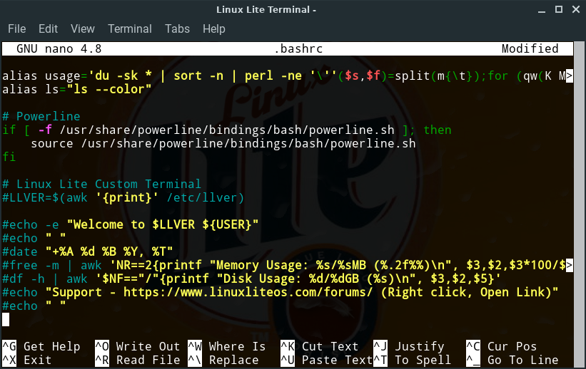

Test the changes by launching the terminal.  The banner should now be gone.

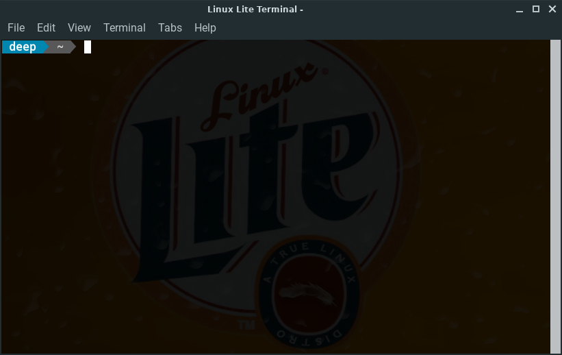

### Assign a Static IP Address
The Jellyfin server is just that, a server.  Client machines must connect to this server to consume the media being served.  To make things easy and a little more fool-proof, I went to the UI of my router and ensured that the Jellyfin server machine was assigned a static IP address.  

---
## Install Jellyfin Server
The installation of Jellyfin was quite simple and is well-documented on the Jellyfin website.  Essentially, the following commands should be executed.  

```
sudo apt install apt-transport-https
wget -O - https://repo.jellyfin.org/jellyfin_team.gpg.key | sudo apt-key add -
echo "deb [arch=$( dpkg --print-architecture )] https://repo.jellyfin.org/$( awk -F'=' '/^ID=/{ print $NF }' /etc/os-release ) $( awk -F'=' '/^VERSION_CODENAME=/{ print $NF }' /etc/os-release ) main" | sudo tee /etc/apt/sources.list.d/jellyfin.list
sudo apt update
sudo apt install jellyfin
```

The first command `sudo apt install apt-transport-https` was not actually needed since the `apt-transport-https` package was already installed by default in Linux Lite.

Once installed, Jellyfin server runs as a service.  To ensure that the service is running properly, the following command was issued.

```
systemctl status jellyfin
```

---
## Configure Jellyfin Server
With everything in place and a running Jellyfin server. I opened up the Firefox webrowser and navigated to `http://localhost:8096` to access the Jellyfin server web-based UI.

The initial screen just wants to know which preferred language to use.

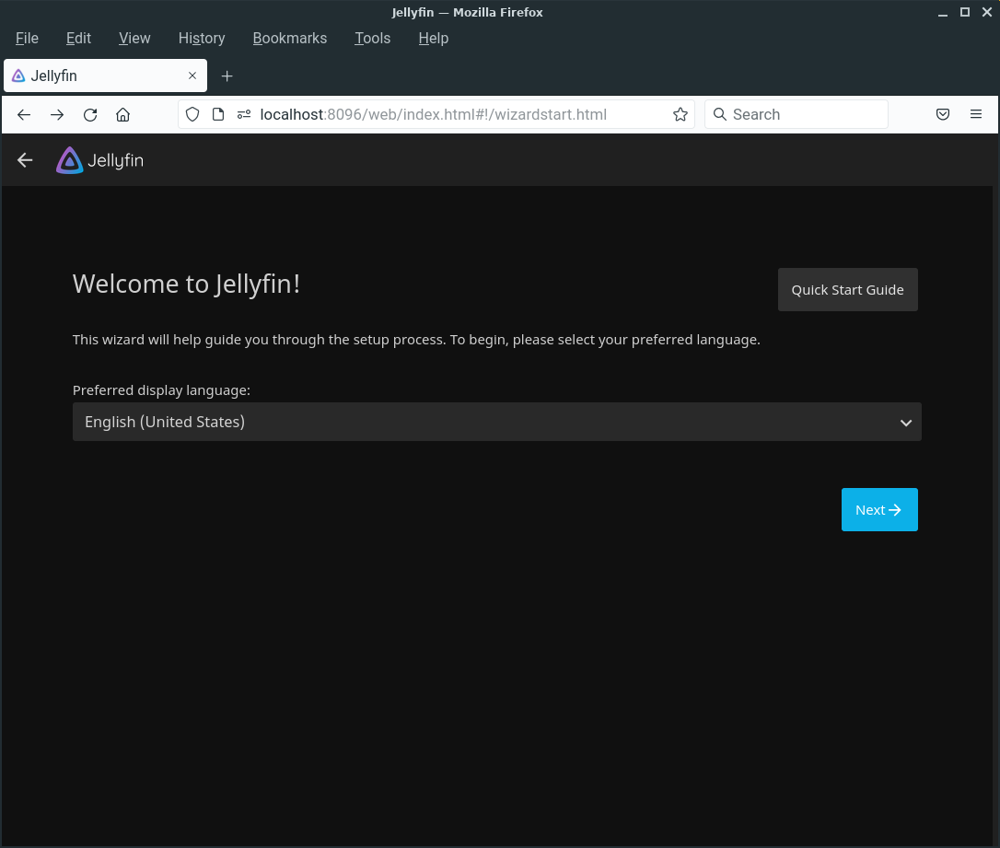

The next screen allows for user creation.  I left the default username of "jellyfin" in place with no password.

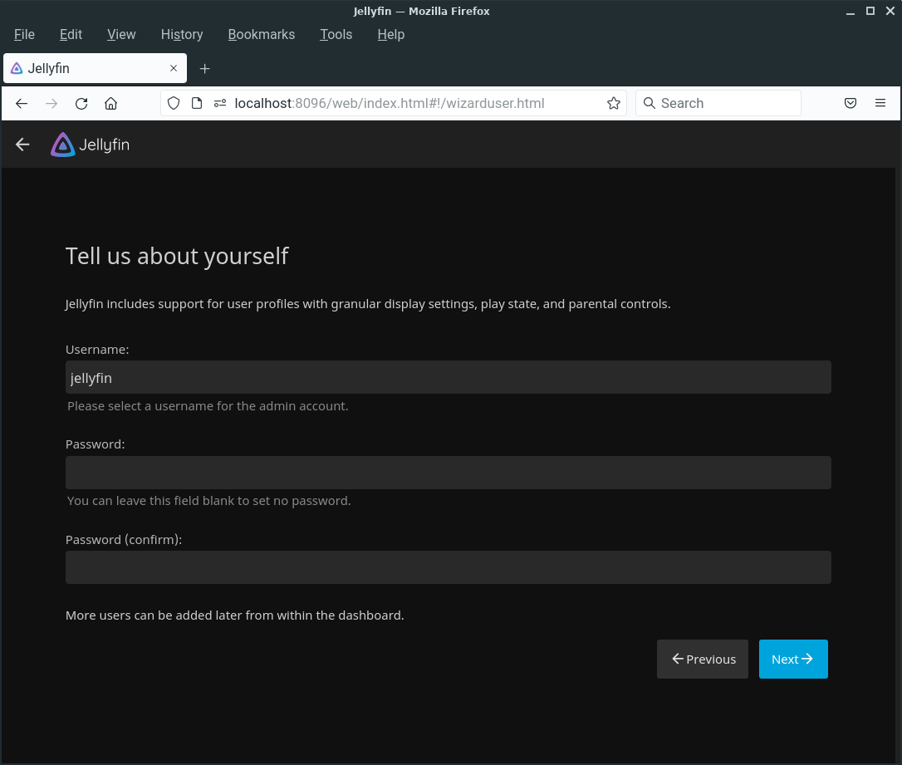

The third screen is the most involved and deals with setting up media libraries, metadata sources, and organization options.  For my setup, I had copied all of my video files into the `/home/deep/Videos` folder.  So, only 1 media library needed to be setup.  After pointing to this folder, I went with all of the default choices.

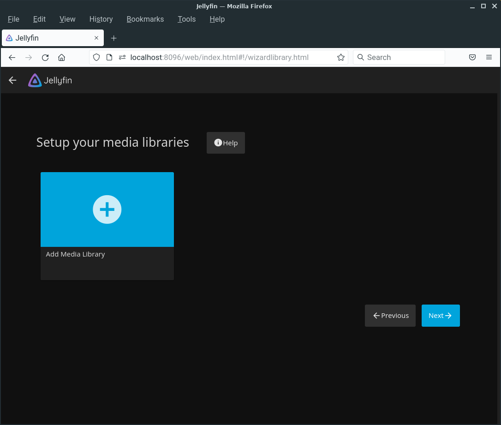

For the subsequent screens, the default options sufficed and clicking the "Next" button confirmed these choices until a "Finish" button appeared indicating that configuration was complete.

---
### Connect Jellyfin Clients
One of the "selling points" for Jellyfin, is the broad ecosystem.  Jellyfin offers a growing list of [clients](https://jellyfin.org/clients/) for a variety of device types.  The most notable are listed below.

* Android
* Fire TV
* iOS
* Kodi
* Linux
* Roku

Based on the devices in my home, I was able to install the proper Jellyfin client application on Android, Linux, and Roku devices. The installation procedure is basically the same for all client devices.  For the sake of obtaining screenshots, an Adroid client was used for this article.

For Android, the application can be found on [F-Droid](https://f-droid.org/en/packages/org.jellyfin.mobile/) and [Google Play](https://play.google.com/store/apps/details?id=org.jellyfin.mobile).

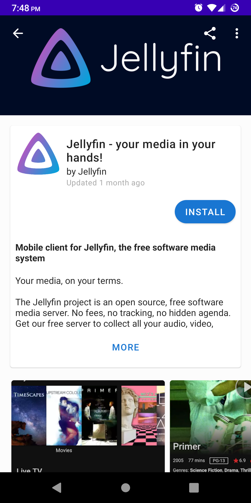

After installation, the initial screen simply needs the URL of the Jellyfin server. 

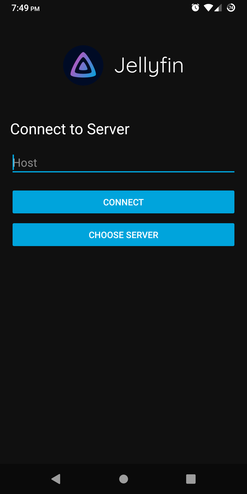

Clicking the "Choose Server" button displays all available Jellyfin servers on the network.

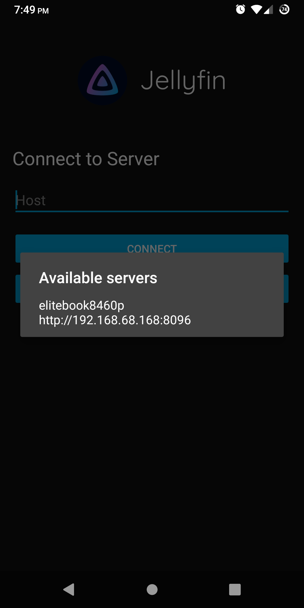

Jellyfin supports multiple users.  However, I found that the default "jellyfin" user with no password was good enough for each and every Jellyfin client.

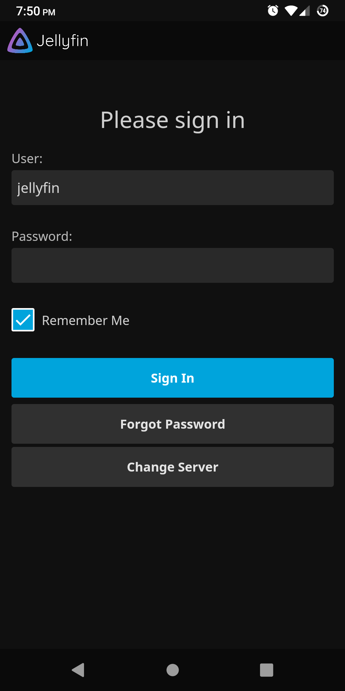

The next few screenshots are my favorites.  They really exhibit the awesomeness of the Jellyfin client.

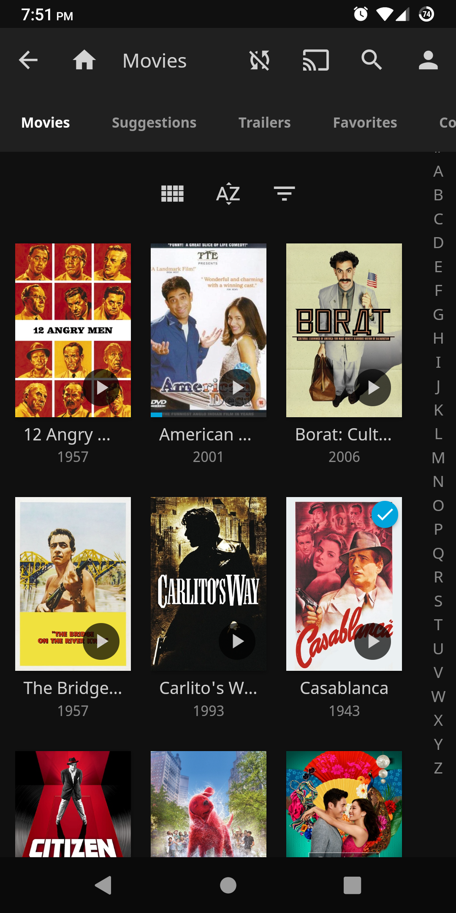

Here we can see that the film "Borat" has been properly tagged with all of the available metadata (reviews, cast, synopsis, rating, etc.).  

"Great success!"

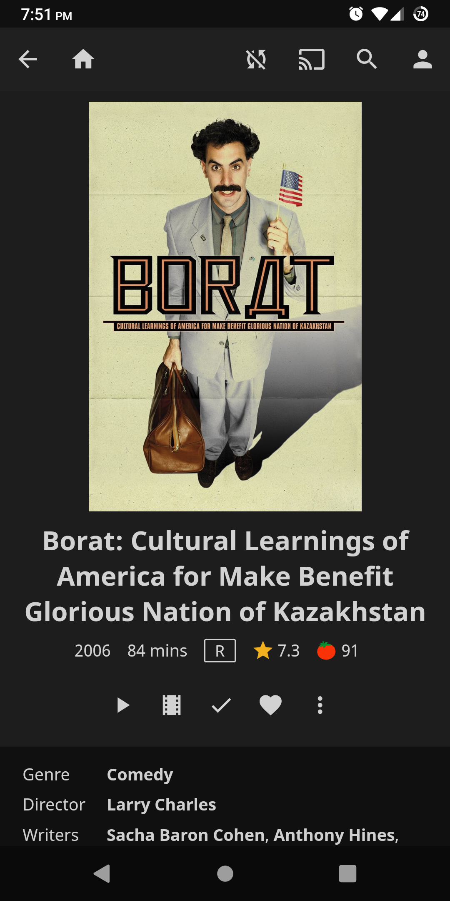

The metadata was automatically obtained from scraping Internet resources.  All of which are configurable on Jellyfin server.  


The metadata isn't just limited to the films themselves, but is also obtained and displayed for notable cast members as well.


---
## Conclusion
This article doesn't scratch the surface of what Jellyfin can do.  With multiple users, synchronized viewing, and other media types (music, photos, etc.), this open source project offeres endless features and possibilities.  For my use cases, having a simple video media server is enough (for now).

Needless to say, Jellyfin has been revolutionary for my video collection, my home, and my family's media consumption methods.  It is the the most prolific open source project we have collectively come across in 2021.  Before, we would have to use a Linux PC/laptop and connect to a shared drive to access media saved on a NAS (nobody did this).  Now, this is no longer necessary.  One old laptop and one old Android phone that were about to be e-recycled have been repurposed to perform their greatest feat of all time: Jellyfin server and input control for Jellyfin server (respectively).  Every television in the house either runs Roku natively or has a Roku device connected to it with the native Roku Jellyfin client app.  This makes it very convenient to browse content and watch a film from the comfort of the couch using a remote control and surround sound.  